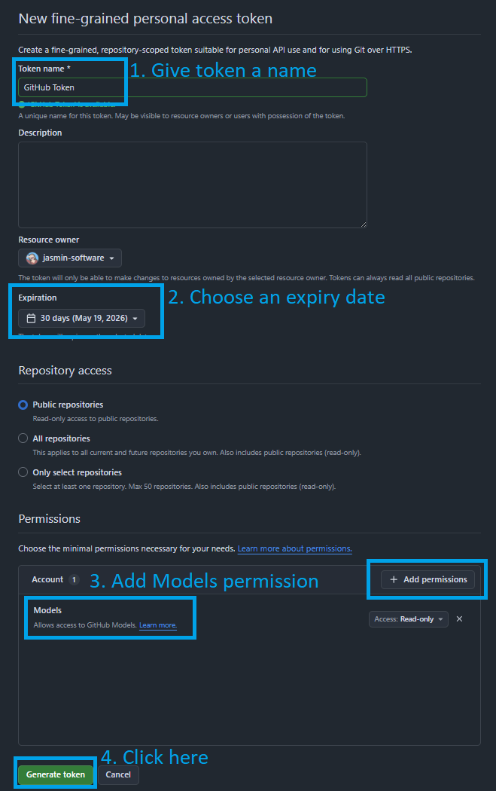
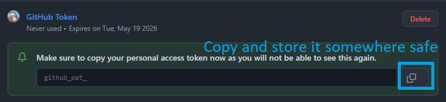

# GitHub Personal Access Token (PAT)

You will need to use an AI Model in order to build the AG-UI server. In today's workshop, we will be using a AI Model hosted at GitHub, which is free for developers. 

## 1. Fine-grained personal access tokens
Click [here](ttps://github.com/settings/personal-access-tokens/new) to go to the **Fine-grained personal access tokens** page, and authenticate.

## 2. Fill in the form
Complete the following fields of the form:
- Token name - Give the token a name
- Expiration - Choose an expiry date
- Permissions - Add `Models` permission  
- And click `Generate token`.

## 3. Copy the token
You cannot view this token again once you leave this page, make sure to save it.

